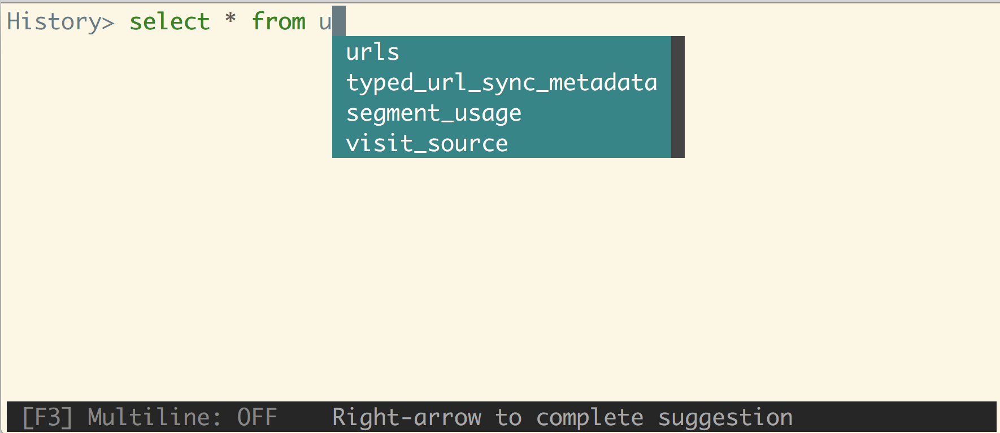

# litecli

[](https://travis-ci.org/dbcli/litecli)

[Docs](https://litecli.com)

A command-line client for SQLite databases that has auto-completion and syntax highlighting.




## Installation

If you already know how to install python packages, then you can install it via pip:

You might need sudo on linux.

```
$ pip install -U litecli
```

The package is also available on Arch Linux through AUR in two versions: [litecli](https://aur.archlinux.org/packages/litecli/) is based the latest release (git tag) and [litecli-git](https://aur.archlinux.org/packages/litecli-git/) is based on the master branch of the git repo. You can install them manually or with an AUR helper such as `yay`:

```
$ yay -S litecli
```
or

```
$ yay -S litecli-git
```

For MacOS users, you can also use Homebrew to install it:

```
$ brew install litecli
```

## Usage

```
$ litecli --help

Usage: litecli [OPTIONS] [DATABASE]

Examples:
  - litecli sqlite_db_name
```

A config file is automatically created at `~/.config/litecli/config` at first launch. See the file itself for a description of all available options.

## Docs

Visit: [litecli.com/features](https://litecli.com/features)
